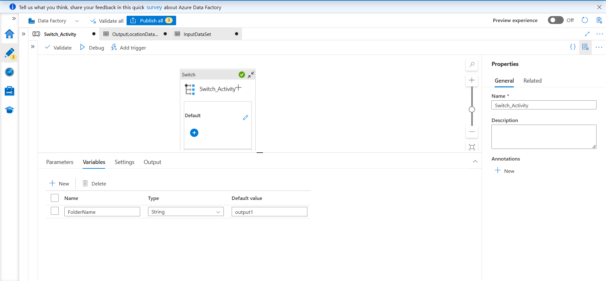
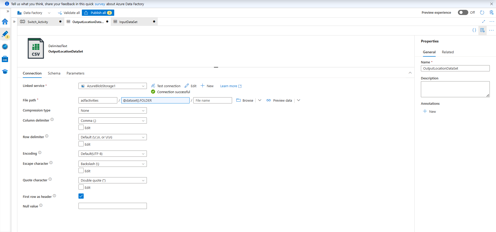
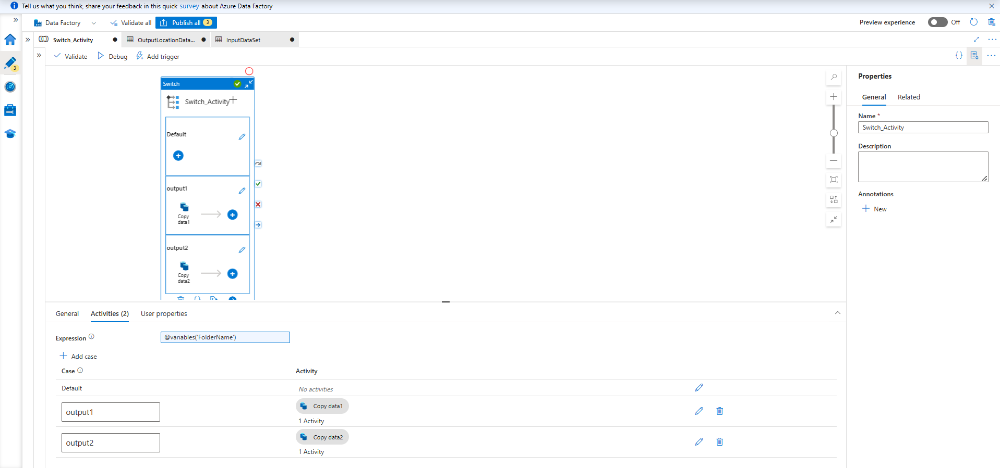
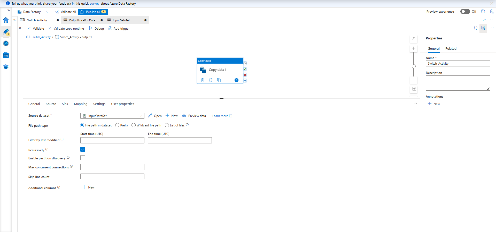
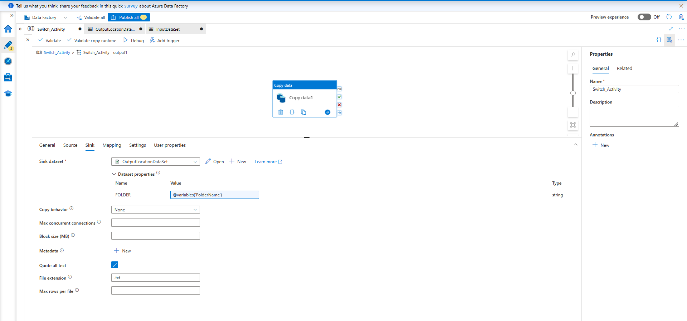
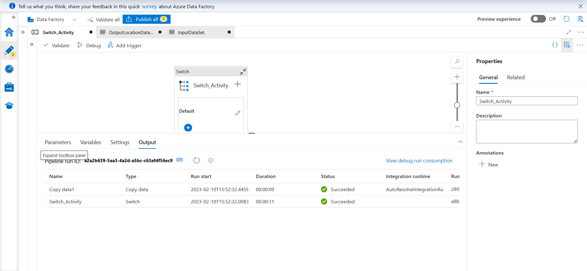

Switch Activity in ADF

Switch Activity provides the same functionality that Switch statement
provides in Programming languages. It evaluates a set of activities
corresponding to a case that matches the condition evaluation.

So here, Pipeline should take file from source location and copy it into
two different locations to output1/Output2 folders based on Pipeline
Parameter value.

{width="6.268055555555556in"
height="2.908333333333333in"}

So here, Parameter Name is 'FolderName', Default value is 'output1'

{width="6.268055555555556in"
height="2.936111111111111in"}

Here, we created a dataset named 'OutputLocationDataSet'. For a Blob
storage; .CSV file format;

In File Path Selected path of container added Container Name & "Add
Dynamic Path" \~ 'FOLDER'. In Parameters, Parameter name is FOLDER.

{width="6.268055555555556in"
height="2.939583333333333in"}

Here, we created a dataset named 'InputDataSet'. For a Blob storage;
.CSV file format;

In File Path Selected path of File. Selected First Row as header.

{width="6.268055555555556in"
height="2.939583333333333in"}

Here, we selected Switch activity; first, we added an Expression. Then,
We added a case output1 & output2.

{width="6.268055555555556in"
height="2.9409722222222223in"}

Case 1: Here we doing copy activity, where we selected a source.

{width="6.268055555555556in"
height="2.9347222222222222in"}

Case 1: Here we doing copy activity, where we selected a sink.

Similarly, we have done for Case 2.

{width="6.268055555555556in"
height="2.902083333333333in"}

And we successfully run the pipeline.
